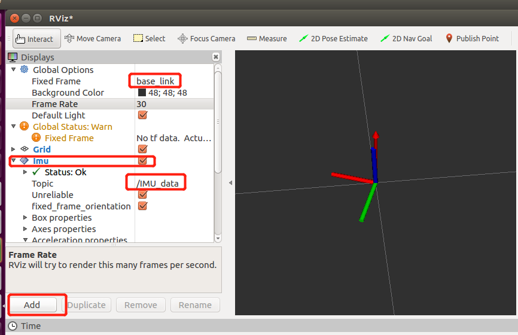

# ROS串口例程

​	本文档介绍如何在ROS下来读取HI226/HI229的数据，并提供了c++语言例程代码，通过执行ROS命令，运行相应的节点，就可以看到打印到终端上的信息。

​	测试环境：Ubuntu16.04   

​	ROS版本：ROS Kinetic Kame

​	测试设备：HI226 HI229

## 查找USB-UART设备

​	Ubuntu 系统自带CP210x的驱动，默认不需要安装串口驱动。将调试版连接到电脑上时，会自动识别设备。识别成功后，会在dev目录下出现一个对应的设备文件。

​	检查系统是否识别到USB-UART设备：

​	1、Ubuntu桌面环境下，按`ctrl + alt + t`打开命令行窗口

​	2、输入 `ls /dev`  查看是挂载成功USB转串口设备

​	3、查看是否存在  ttyUSBx 这个设备文件。x表示USB设备号，由于Ubuntu USB设备号为从零开始依次累加，所以多个设备每次开机后设备号是不固定的，需要确定设备的设备号，没有插入HI226/HI229评估板时的dev设备列表：



​	上图为没有插入USB设备的情况，这个时候，dev目录下并没有名为 __ttyUSB__ 文件，插入USB线，连接调试板，然后再次执行`ls /dev`：

dev目录下多了几个文件名称, 如图：


​	**ttyUSB0** 文件就是调试版在ubuntu系统中生成的设备文件，对它进行读写，就可以完成串口通信。设备文件名需要记住。后面的数字是不固定的，有可能为 ttyUSB1  或 ttyUSB2等。

## 安装serial软件包

​	本例程使用ROS提供的serial包实现串口通信.

​	首先执行如下命令，下载安装serial软件包：

```shell
$ sudo apt-get install ros-kinetic-serial
```

然后输入`roscd serial`命令，进入serial下载位置，如果安装成功，就会出现如下信息：

```shell
$:/opt/ros/kinetic/share/serial
```

## 创建工作空间

先输入命令`export | grep ROS`确定环境变量是否设置正确。

若出现如下信息，说明是正确的：

```shell
declare -x ROSLISP_PACKAGE_DIRECTORIES=""
declare -x ROS_DISTRO="indigo"
declare -x ROS_ETC_DIR="/opt/ros/indigo/etc/ros"
declare -x ROS_MASTER_URI="http://localhost:11311"
declare -x ROS_PACKAGE_PATH="/opt/ros/indigo/share:/opt/ros/indigo/stacks"
declare -x ROS_ROOT="/opt/ros/indigo/share/ros"
```

如果已经有创建好的工作空间，在__ROSLISP_PACKAGE_DIRECTORIES__后边会跟着工作空间的路径。

如果不正确，请先设置环境变量。

创建一个工作空间，名为__catkin_ws__：

```shell
$ mkdir -p ~/catkin_ws/src
$ cd ~/catkin_ws/src
$ catkin_init_workspace
```

进入工作空间，编译工程。

```shell
$ cd ~/catkin_ws
$ catkin_make
```

这时候，可以看到build和devel两个文件夹，和src并列。

在devel文件夹中，有几个setup.*sh文件，通过source命令激活这些文件中任何一个文件都会将这个工作空间覆盖到环境中：

```shell
$ source devel/setup.bash
```

然后输入`echo $ROS_PACKAGE_PATH`命令，确认工作空间的路径是否设置正确。

如果出现  __/opt/ros/kinetic/share__  ，说明设置正确。

## 编译serial_imu节点

​	接下来，执行`cd ~/catkin_ws/src`命令，进入src目录，将本文档所在的目录下的serial_imu文件夹复制到src目录下。

​	然后回到catkin_ws目录下，执行`catkin_make`命令，编译成功后出现完成度100%的信息。

## 修改配置

​	在Ubuntu环境中，支持的波特率为115200, 460800, 921600，本例程使用的是115200。

​	本例程使用的波特率是115200，打开的串口名称是/dev/ttyUSB0，默认的输出频率为100Hz。如果您需要更高的输出频率，请执行`cd ~/catkin_ws/src/serial_imu/src`命令，进入src目录，打开serial_imu.cpp文件，修改serial_imu.cpp文件中的宏定义，改为更高的波特率。	

```c
#define IMU_SERIAL "/dev/ttyUSB0"
#define BAUD 115200
```

​	如图所示：修改到合适的波特率和正确的串口设备名称。

​	修改完成后，在回到catkin_ws目录下，重新执行`catkin_make`命令，重新生成。

​	生成成功后，就可以执行相应的节点，来查IMU的数据。

## 查看数据

​    本例程提供了三种查看方式：第一种方式是显示所有的数据信息；第二种是ROS定义的话题方式；第三种是借助于rviz工具实现可视化，可以更直观的感受IMU的姿态。

### 	第一种：自定义

​	这种方式，是我们自己定义的一种的显示方式，把imu上传的所有的信息都打印到终端上，便于查看数据。

​	打开一个终端，执行`roscore`命令。

​	然后重新打开一个终端，执行`rosrun serial_imu serial_imu`命令。

​	执行成功后，就可以看到所有的信息：

```txt

     Devie ID:     0
    Run times: 0 days  3:26:10:468
  Frame Rate:   100Hz
       Acc(G):   0.933    0.317    0.248
   Gyr(deg/s):   -0.02     0.30    -0.00
      Mag(uT):    0.00     0.00     0.00
   Eul(R P Y):   52.01   -66.63   -60.77
Quat(W X Y Z):   0.770    0.066   -0.611   -0.172
Pleaes enter ctrl + 'c' to quit....

```

### 	第二种：ROS Imu.msg

​	打开一个终端，执行`cd ~/catkin_ws/src`命令，进入src目录，将本文档所在的目录下的super_launch文件夹复制到src目录下。

​	执行`cd ~/catkin_ws`命令，回到工作空间，再执行`catkin_make`,进行编译launch文件。

​	编译成功后，执行`roslaunch super_launch super_imu.launch`命令。

​	执行成功后，就可以看到ROS定义的IMU话题消息：

```txt
[subscriber_HI226-2] killing on exit
header: 
  seq: 595
  stamp: 
    secs: 1595829903
    nsecs: 680423746
  frame_id: "base_link"
orientation: 
  x: 0.0663746222854
  y: -0.611194491386
  z: -0.17232863605
  w: 0.769635260105
orientation_covariance: [0.0, 0.0, 0.0, 0.0, 0.0, 0.0, 0.0, 0.0, 0.0]
angular_velocity: 
  x: 0.0851199477911
  y: 0.0470183677971
  z: 0.00235567195341
angular_velocity_covariance: [0.0, 0.0, 0.0, 0.0, 0.0, 0.0, 0.0, 0.0, 0.0]
linear_acceleration: 
  x: 0.93323135376
  y: 0.317857563496
  z: 0.247811317444
linear_acceleration_covariance: [0.0, 0.0, 0.0, 0.0, 0.0, 0.0, 0.0, 0.0, 0.0]

```

### 	第三种：rviz可视化工具

​	为了更形象的显示IMU姿态，可以下载rviz_imu_plugin插件并安装。

​	打开一个终端，进入catkin_ws中，然后安装git.

```shell
sudo apt-get install git-core
```

​	然后把需要的imu工具下载到ros的工作空间中

```shell
git clone -b indigo https://github.com/ccny-ros-pkg/imu_tools.git
```

​	安装工具

```shell
rosdep install imu_tools
```

​	如果提示__#All required rosdeps installed successfully__，说明安装成功了。

​	接下来执行`catkin_make`。

​	执行成功后，执行`roslaunch super_launch super_rviz.launch`命令。

​	执行成功后，就可以看到rviz工具已经打开了，这个时候我们还需要进行配置一下，订阅相应的话题消息，才能在rviz的世界中看到一个坐标轴随着IMU传感器的变化而变化。

​	先点击左下角的Add标签，然后在弹出窗口中，选择__By display type__标签，查找__rviz_imu_plugin__；找到之后，选择它下面的__imu__标签，点击OK,

​	这时，我们可以看到rviz的左侧的展示窗口中已经成功添加上了Imu的标签。

​	接下来在__Global Options__下的__Fixed Frame__中，添写__base_link__。

​	然后在__Imu__下的__Topic__中，添写__/IMU_data__。

​	这时，去晃动imu传感器，可以看到rviz世界中的坐标轴已经随着imu传感器的晃动发生了晃动。

## FAQ

​	如果在执行`rosrun serial_imu serial_imu`时候，出现如下错误：


​	这是由于没有配置环境的原因导致的，解决办法就是在当前终端执行`source ~/catkin_ws/devel/setup.bash`命令。

​	但是这个办法并不能一次性解决，每次开启一个终端，运行新节点都需要为该终端设置环境变量。所以按照如下方式，可以不用这么麻烦：

​	执行`gedit ~/.bashrc`命令，打开一个文件，然后在这个文件的末尾加入ROS程序注册命令。

```shell
$ source /home/linux/catkin_ws/devel/setup.bash
```

​	保存并退出。

​	还有就是可能会遇到串口打开失败，权限不够。执行如下命令，申请权限。

```shell
$ sudo chmod 777 /dev/ttyUSB0
```

​	然后开启一个终端，执行`rosrun serial_imu serial_imu`命令，执行成功。